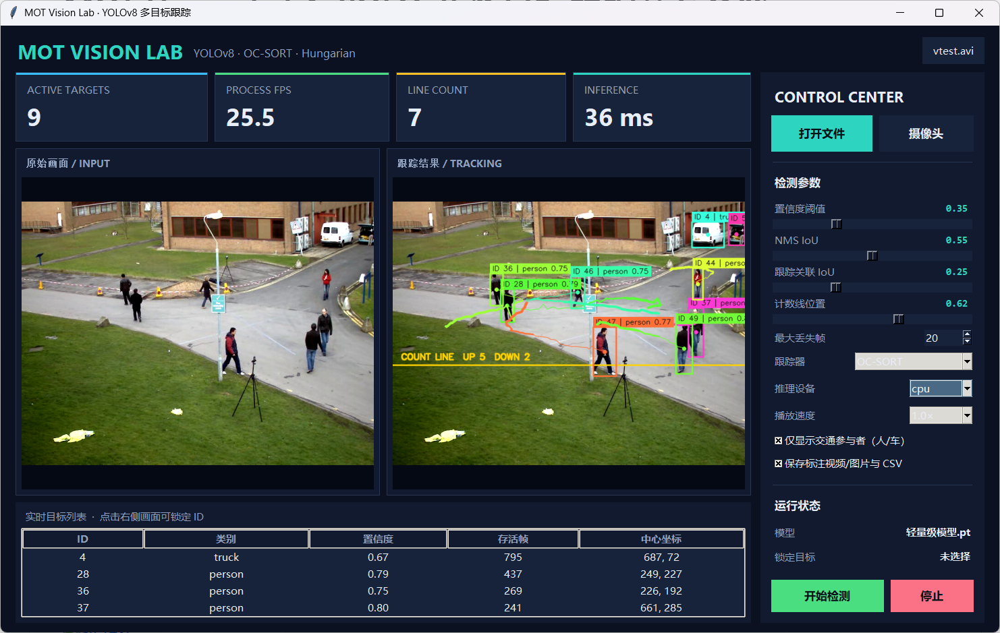

# MOT Vision Lab：YOLOv8 多目标跟踪交互系统

这是对原“YOLOv8 + Qt 智能交通监控”项目的可运行复现与二次开发版本。新入口 `mot_app.py` 不依赖旧版 PySide6/supervision 接口，默认使用 YOLOv8 **逐帧检测**与 OC-SORT 关联，以优先保证目标观测和 ID 连续性。当前 OC-SORT 分支采用原版的 7 维 `[cx, cy, area, ratio, vx, vy, v_area]` Kalman 状态，并保留本项目的类别约束与低分框救回扩展；不是直接运行上游仓库的未经修改版本。项目保留可配置的跳帧消融与按需人员 ReID 接口。

这里的 TOPIC-Lite 是面向本项目计算预算的工程化可选方案，并非对 TOPICTrack 论文全部模块的逐项复现。缺少 ReID 权重时会明确回退为“OC-SORT + Detect/1”，不会把纯运动结果标记成已启用 ReID。

## 已实现功能

- 图片、视频、本地摄像头三类输入；原始画面与跟踪结果并排显示。
- YOLOv8 目标检测，支持置信度和 NMS IoU 动态配置。
- 检测模型可选原多类别模型或训练完成后的人员专用模型，避免人员单类微调覆盖车辆检测能力。
- 可切换 `OC-SORT / Kalman-Hungarian` 跟踪器，便于使用同一检测器做可视化对照。
- 默认逐帧检测；可配置的跳帧模式仅保留作速度与关联质量的消融对照，跳帧期间用 Kalman 传播轨迹。
- OC-SORT 包含方向一致性匹配（OCM）、最后观测重关联（OCR）、遮挡后重更新（ORU）和低置信度二阶段救回。
- 可选人员 ReID 采用运动优先快速路径：新建轨迹只缓存人员裁剪，不执行 ReID；仅在候选匹配接近或遮挡恢复时提取外观特征。权重需放到 `weights/person_reid.onnx`。
- OC-SORT 使用 7 维 Kalman 状态 `[cx, cy, area, ratio, vx, vy, v_area]`；可切换的 Kalman-Hungarian 基线仍使用 8 维状态 `[cx, cy, w, h, vx, vy, vw, vh]`。两者均使用类别约束 IoU 与 Hungarian 全局匹配。
- Track ID、运动轨迹、最大丢失帧与轨迹生命周期管理。
- 可调计数线和上下行累计计数。
- 点击检测框或目标表格锁定 ID；支持开始、暂停、继续和停止。
- 开始/停止按钮固定显示在右侧上方；参数区可滚动，缩小窗口时仍可操作。
- 视频播放速度支持 `0.5× / 1.0× / 2.0× / 不限速`，可在运行中即时调整。
- 标注图片/MP4 与逐帧跟踪 CSV 导出。
- 高 DPI Windows 适配、Unicode 路径图片读写、GUI 后台线程推理。



## 一键运行

当前机器已验证的解释器为 `D:\miniconda\envs\PJT_1\python.exe`，可直接执行：

```powershell
Set-Location F:\Team_porject\MOT-main
.\run_mot.ps1
```

如果当前终端提示符包含 `MINGW64`，说明使用的是 Git Bash，应执行：

```bash
./run_mot.sh
```

若在其他机器复现，推荐 Python 3.10：

```powershell
python -m venv .venv
.\.venv\Scripts\Activate.ps1
python -m pip install -r requirements-repro.txt
python mot_app.py
```

`torch` 的 CUDA 版本应按本机显卡和驱动单独选择；没有 NVIDIA GPU 时界面会自动使用 CPU。

## 操作说明

1. 启动后默认载入仓库内置 `bus.jpg`，点击“开始检测”即可验证完整链路。
2. “打开文件”选择图片或视频；“摄像头”输入设备编号。
3. 运行前可选择 `OC-SORT` 或 `Kalman-Hungarian`；若已完成训练，还可选择“人员微调模型”。调整检测阈值、关联阈值、最大丢失帧和计数线位置。播放速度默认为 `1.0×`，跑性能测试时选择“不限速”。
4. 在跟踪画面点击目标框，或在下方目标表格选择一行，即可锁定 Track ID。
5. 勾选保存后，结果写入 `outputs/run_时间戳/`：
   - 图片输入：`result.jpg`
   - 视频/摄像头输入：`result.mp4`
   - 所有输入：`tracks.csv`

快捷键：`Space` 开始/暂停/继续，`Esc` 停止，`Ctrl+O` 打开文件。

## 处理链路

```text
图片 / 视频 / 摄像头
        │
        ▼
YOLOv8 检测（默认逐帧；bbox / class / confidence）
        │
        ▼
OC-SORT：Kalman 预测 ── OCM/OCR ── 低分救回 ── ORU
        │
        └── 仅冲突/遮挡恢复：人员 ReID 外观融合（可选）
        │
        ├── 匹配轨迹：Kalman 更新、延续 ID
        ├── 未匹配检测：创建新 ID
        └── 未匹配轨迹：超过 max_age 后删除
        │
        ▼
轨迹绘制 / 越线计数 / GUI 指标 / MP4 + CSV 导出
```

关键文件：

| 文件 | 作用 |
| --- | --- |
| `mot_core.py` | 检测器封装、Kalman Track、Hungarian 关联、计数与可视化 |
| `mot_app.py` | Tkinter 交互窗口、后台工作线程、输入输出与 ID 点选 |
| `benchmark_trackers.py` | 固定同一批检测结果，对比基线跟踪器与 OC-SORT |
| `evaluate_mot17.py` | 缓存 YOLOv8 检测并在 MOT17 上运行双跟踪器与 TrackEval |
| `prepare_person_dataset.py` | 将 MOT17/CrowdHuman 转为单类人员 YOLO 数据，并按完整序列留出验证集 |
| `train_person_detector.py` | 微调人员检测器并导出最优权重 |
| `evaluate_person_detector.py` | 单独报告 Precision、Recall、mAP50 与 mAP50-95 |
| `benchmark_topic_lite.py` | CPU/GPU 无缓存吞吐测试，可选保存 MP4 并计入编码耗时 |
| `tests/test_mot_core.py` | IoU、ID 连续性、类别约束和越线计数单元测试 |
| `run_mot.ps1` | Windows 一键启动脚本 |
| `requirements-repro.txt` | 新交互版本的最小依赖 |
| `main.py` | 原项目的旧 PySide6 入口，仅保留作参考 |

## 验证

### 1. 单元测试

```powershell
D:\miniconda\envs\PJT_1\python.exe -m unittest discover -s tests -v
```

当前结果：20/20 通过，覆盖 IoU、ID 延续、类别隔离、越线计数、OC-SORT 7 维状态及 ORU 遮挡恢复、低分救回、跳帧预测、按需 ReID 门控和 MOTChallenge 格式转换。

### 2. 跟踪器固定检测 A/B

```powershell
D:\miniconda\envs\PJT_1\python.exe benchmark_trackers.py --input F:\Opencv\opencv\sources\samples\data\vtest.avi --device cpu --output outputs\my_ocsort7d_ab.json
```

795 帧固定检测流的 7 维 OC-SORT 实测见 `outputs/ocsort7d_ab_vtest_20260924.json`：执行 114 次低分救回、47 次 ORU；可见轨迹记录从 6181 增至 6257，跟踪耗时从约 1.71 ms/帧增至 3.25 ms/帧。`vtest.avi` 没有跟踪真值，单凭这份记录不能宣称 IDF1/IDSW 提升。

### 3. MOT17 + TrackEval 标准评测

本机已存在 MOT17 和 TrackEval 时可直接执行；也可以通过 `--dataset-root` 与 `--trackeval-root` 指定路径：

```powershell
D:\miniconda\envs\PJT_1\python.exe evaluate_mot17.py --device cpu --output outputs\my_ocsort7d_eval
```

Git Bash 对应命令：

```bash
/d/miniconda/envs/PJT_1/python.exe evaluate_mot17.py --device cpu --output outputs/my_ocsort7d_eval
```

评测覆盖 MOT17 训练集 7 个不重复 FRCNN 序列，共 5316 帧。两个跟踪器消费同一份 YOLOv8 检测缓存，当前 7 维版本的完整结果见 `outputs/mot17_eval_ocsort7d_cpu_interval1_20260924/report.md`：

| 方案 | HOTA | AssA | IDF1 | IDSW | Frag | 跟踪均值 ms |
| --- | ---: | ---: | ---: | ---: | ---: | ---: |
| Kalman-Hungarian | 36.575 | 44.056 | 42.400 | 537 | 1561 | 1.013 |
| OC-SORT（7 维） | 38.618 | 45.726 | 45.859 | 372 | 651 | 3.402 |

7 维 OC-SORT 方案的 HOTA 提升 2.043 个百分点、IDF1 提升 3.459 个百分点，IDSW 减少 165、Frag 减少 910；代价是跟踪耗时增加，FP 从 4026 增至 6455。两者虽然读取同一检测缓存，但基线只消费高分框，OC-SORT 还使用低分框，结果是整套方案对照而非纯状态维度消融。该结果是带标签训练集上的本地回归评测，不是 MOTChallenge 隐藏测试集排行榜成绩。原 `20260923` 报告属于历史 8 维版本，不代表当前实现。

### 4. CPU 性能与检测间隔消融

```powershell
D:\miniconda\envs\PJT_1\python.exe benchmark_topic_lite.py --input F:\Opencv\opencv\sources\samples\data\vtest.avi --device cpu --detection-interval 1 --output outputs\topic_lite_cpu_vtest_interval1.json
```

在 `vtest.avi` 全部 795 帧上的同机无缓存测试如下。范围包含解码、检测/预测、跟踪与叠加绘制，不包含 GUI 刷新和视频编码；数据来自 7 维 OC-SORT 当前版本：

| 检测策略 | CPU FPS | 检测帧数 | 检测均值 ms/检测帧 | 跟踪均值 ms/视频帧 |
| --- | ---: | ---: | ---: | ---: |
| 每帧检测（当前默认） | 20.75 | 795 | 40.73 | 3.04 |
| 每 2 帧检测（消融） | 38.22 | 398 | 40.64 | 1.61 |

如果需要测量**保存标注视频**时的吞吐量，在 Git Bash 中运行：

```bash
/d/miniconda/envs/PJT_1/python.exe benchmark_topic_lite.py \
  --input /f/Opencv/opencv/sources/samples/data/vtest.avi \
  --device cpu --detection-interval 1 \
  --save-video outputs/my_vtest_encoded.mp4 \
  --output outputs/my_vtest_encoded.json
```

本机对同一 795 帧视频逐帧检测并保存 MP4 的实测为 **19.47 FPS**，MP4 写入均值约 **2.71 ms/帧**；记录为 `outputs/ocsort7d_cpu_vtest_encoded_20260924.json`，视频为同名 `.mp4`。隔 2 帧检测并保存 MP4 为 34.29 FPS，但关联质量较低。该结果包含解码、检测/预测、跟踪、叠加绘制和 MP4 编码，仍不包含 GUI 刷新，也未启用 ReID。窗口中勾选“保存标注视频/图片与 CSV”时，会在 `outputs/run_时间戳/result.mp4` 保存视频；窗口“PROCESS FPS”按最近 30 帧的实际处理耗时统计（首帧模型预热不计入稳态值），计入视频与 CSV 写入，不计入播放等待和界面刷新。基准脚本为避免误覆盖，目标 MP4 已存在时会报错，请换一个新文件名重测。

隔 2 帧检测相对逐帧检测的无编码速度约为 1.84 倍，但它不是零代价优化。同一份 CPU 检测缓存覆盖的 MOT17 七个序列、5316 帧 TrackEval 消融如下（均使用 7 维 OC-SORT，未启用 ReID）：

| 检测策略 | HOTA | IDF1 | IDSW | Frag |
| --- | ---: | ---: | ---: | ---: |
| 每帧检测（当前默认） | 38.618 | 45.859 | 372 | 651 |
| 每 2 帧检测（消融） | 37.464 | 44.193 | 466 | 1624 |

逐帧检测相对隔 2 帧检测，HOTA、IDF1 分别提高 1.154、1.666 个百分点，IDSW 减少 94，Frag 减少 973，因此保持逐帧为默认策略。代价是此机器上包含 MP4 编码的 CPU 平均吞吐为 19.47 FPS，略低于原定 20 FPS 目标；不同视频和设备不可外推。完整结果见 `outputs/mot17_eval_ocsort7d_cpu_interval1_20260924/report.md` 与 `outputs/mot17_eval_ocsort7d_cpu_interval2_20260924/report.md`。微调与真实 ReID 权重接入前，不应宣称更高的跟踪精度。

### 5. 人员检测微调与独立评测

准备 MOT17/CrowdHuman 单类人员数据：

```powershell
D:\miniconda\envs\PJT_1\python.exe prepare_person_dataset.py --crowdhuman-root 'F:\实际存放路径\CrowdHuman'
D:\miniconda\envs\PJT_1\python.exe train_person_detector.py --device 0
D:\miniconda\envs\PJT_1\python.exe evaluate_person_detector.py --device cpu
```

数据准备脚本默认将 MOT17-11-FRCNN、MOT17-13-FRCNN 整段序列留作验证，避免同一视频相邻帧同时进入训练和验证。训练默认采用较保守的初始学习率 `0.001`、冻结前 10 层；完成后最优权重导出到 `weights/person_mot17_crowdhuman.pt`，GUI 下次启动即可选择“人员微调模型”；默认仍为原多类别模型，用于人车混合场景。

将命令里的 CrowdHuman 路径替换为实际目录。当前机器尚未发现 CrowdHuman 数据，因此只生成了 MOT17 基线数据，没有执行 MOT17/CrowdHuman 联合微调。原轻量模型在 1650 张 MOT17 留出图像上的基线为 Precision 83.34%、Recall 51.28%、mAP50 70.41%、mAP50-95 49.91%（验证参数 `conf=0.25`）；距离“约 90%”目标仍有明显差距，尤其是 Recall。

已完成两轮 **MOT17 单数据集实验**，均未达到替换原模型的质量要求：

| 人员检测模型 | Precision | Recall | mAP50 | mAP50-95 |
| --- | ---: | ---: | ---: | ---: |
| 原轻量模型 | 83.34% | 51.28% | 70.41% | 49.91% |
| MOT17 微调 10 轮 | 79.43% | 50.05% | 68.43% | 48.35% |
| MOT17 低学习率冻结 5 轮 | 78.12% | 51.38% | 68.05% | 47.43% |

低学习率权重在 `vtest.avi` 上达到 60.65 FPS（同样不含 GUI/编码），但在两条完整留出视频上的 HOTA 从原模型 35.581 降至 33.872，IDF1 从 41.207 降至 37.331，IDSW 从 130 增至 271。因此窗口仍默认使用原模型，两个实验权重只保留作对照。`weights/person_mot17_crowdhuman.pt` 需要等联合数据训练和独立评估通过后再作为人员模型选用。

### 6. TOPIC-Lite 标准跟踪评测

将兼容的人员 ReID ONNX 模型放到 `weights/person_reid.onnx` 后，可运行：

```powershell
D:\miniconda\envs\PJT_1\python.exe evaluate_mot17.py --device cpu --model weights\person_mot17_crowdhuman.pt --detection-interval 1 --reid-model weights\person_reid.onnx --sequences MOT17-11-FRCNN MOT17-13-FRCNN --output outputs\mot17_eval_topic_lite_holdout
D:\miniconda\envs\PJT_1\python.exe benchmark_topic_lite.py --input F:\Opencv\opencv\sources\samples\data\vtest.avi --device cpu --model weights\person_mot17_crowdhuman.pt --detection-interval 1 --reid-model weights\person_reid.onnx --output outputs\topic_lite_full_cpu_vtest.json
```

评测只使用微调时未参与训练的两条 MOT17 序列，分别输出 HOTA、IDF1、IDSW、Frag 等跟踪指标，并记录 ReID 调用次数和耗时。第二条命令检查完整模型接入后 CPU 是否仍达到 20 FPS。ONNX 输入约定为 256×128 的 RGB 人员裁剪、ImageNet mean/std 归一化，输出需为可 L2 归一化的身份向量；在提供匹配该预处理的权重前，界面会显示“待放入 person_reid.onnx”。

### 7. 无窗口端到端测试

```powershell
.\run_mot.ps1 --smoke-test --device 0
```

2026-09-22 在内置 `bus.jpg` 上验证：模型成功加载，得到 6 个检测和 6 条初始轨迹，结果输出到 `outputs/smoke_test/result.jpg`。

### 8. GUI 视觉测试

```powershell
.\run_mot.ps1 --ui-smoke-test
```

该命令会启动窗口、处理内置示例、保存 `outputs/ui_smoke_test.png` 后自动退出。视觉验收确认了双画面、KPI 卡片、参数侧栏、目标表格和结果状态均完整显示。

> 性能说明：静态图的首帧推理包含模型初始化，不能作为视频稳态 FPS。当前 7 维 OC-SORT 逐帧设置在本机无 GUI/编码基准下为 20.75 FPS；保存 MP4 后为 19.47 FPS，仍不含 GUI。简历中应注明测试条件，不宜外推到所有边缘设备。

## 原项目与许可

原项目参考了 `Jai-wei/YOLOv8-PySide6-GUI`、Ultralytics YOLO 与 Qt for Python。仓库沿用 GPL-3.0 许可；
